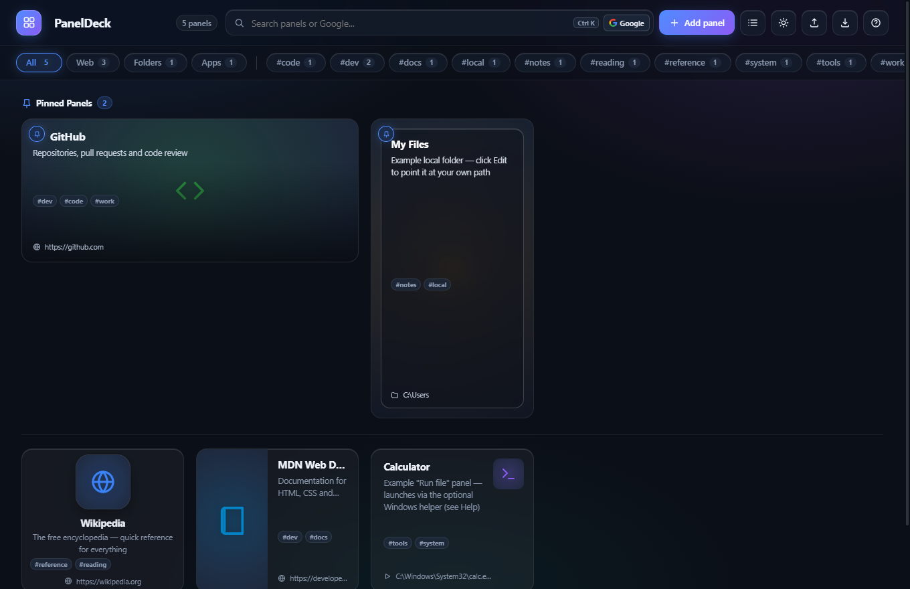
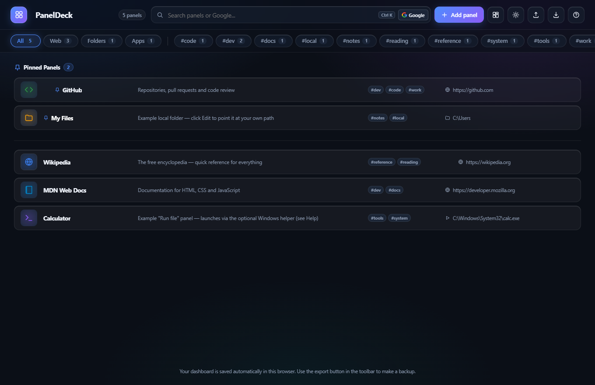
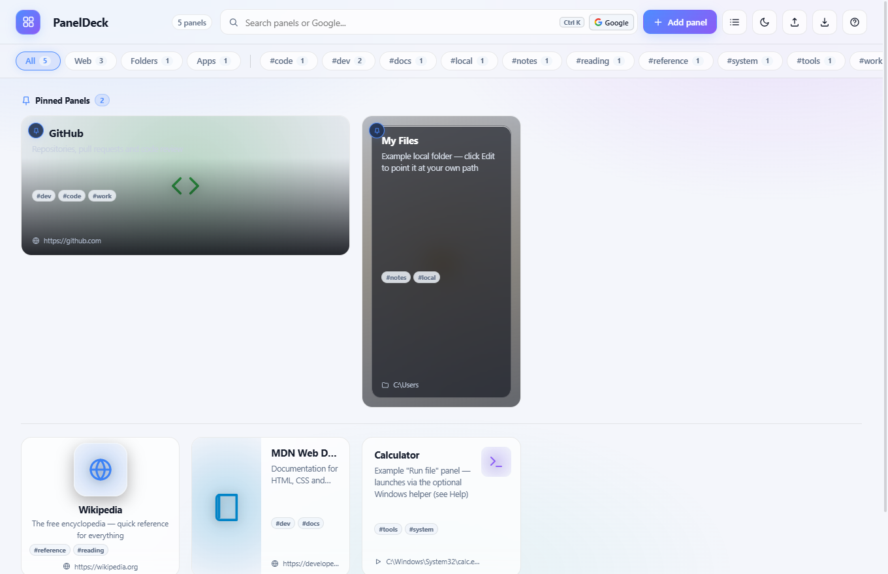

# PanelDeck 🎛️

> **Modern Bento Glassmorphic Personal Dashboard & Quick Launcher**
>
> 100% self-contained, zero-dependency, single-file HTML application built for local desktop browsers and Obsidian vaults.

[](https://cj-1981.github.io/paneldeck/)
[](https://github.com/CJ-1981/paneldeck/actions)

🌐 **Try it Live in your Browser:** [https://cj-1981.github.io/paneldeck/](https://cj-1981.github.io/paneldeck/)

---

## ✨ Overview

**PanelDeck** is a lightning-fast, highly customizable startpage and dashboard designed to organize web bookmarks, local project folders, files, and executable tools in one visually stunning workspace.

Featuring a **Bento Glassmorphism** design system, PanelDeck pairs translucent frosted glass materials and atmospheric ambient mesh glows with deep productivity controls: spotlight search hotkeys, automatic tag aggregation, a dedicated pinned shelf, dual density modes, and drag-and-drop organization.

---

## 📸 Screenshots

### Bento Grid Mosaic View (Dark Theme)
*Showcasing fluid spotlight search, pinned shelf, dynamic category filter pills, and custom bento card aspect ratios.*



### Compact List View (High Density)
*Ideal for sidebar embeds, narrow monitors, or minimalists who prefer rapid scanning with identical column alignment across all 8 card styles.*



### Light Theme Glassmorphism
*Crisp daylight aesthetic featuring frosted specular highlights and soft colored ambient shadows.*



---

## 🚀 Key Features

### 💎 Bento Glassmorphic Aesthetics
* **Atmospheric Auras:** Layered multi-point radial mesh glow radiating softly in both Dark and Light themes.
* **Frosted Glass Elevation:** Real-time backdrop blurring (`backdrop-filter: blur(16px)`), specular inner border edge highlights (`inset 0 1px 0 rgba(...)`), and personalized accent glow on hover.
* **Physics Micro-Interactions:** Smooth spring transitions (`cubic-bezier(0.16, 1, 0.3, 1)`) across hover states, size changes, and modal overlays.

### 🔍 Spotlight Search (`Ctrl+K` / `/`)
* **Instant Hotkey Focus:** Press `Ctrl+K` or `/` from anywhere on the page to focus the search bar.
* **Live Matching:** Filters panels in real time with an instant counter pill.
* **One-Click Clear:** Interactive `✕` button appears when typing.
* **Google Fallback:** Hit `Enter` or click the Google button when no local cards match to immediately query Google in a new tab.

### 🏷️ Dynamic Filter Bar & Tag Aggregation
* **Smart Category Chips:** One-click filtering by resource type: **All**, **Web**, **Folders**, and **Apps**.
* **Automatic Tag Aggregation:** Scans all cards in storage and dynamically generates interactive tag pills (e.g. `#work`, `#dev`, `#tools`) with live item counts.
* **Sticky Frosted Header:** Stays pinned at the top on long dashboard scrolls.

### 📌 Dedicated Pinned Shelf
* **Top-Shelf Priority:** Pin your most critical daily tools to a dedicated glowing top shelf.
* **One-Click Pinning:** Pin or unpin directly from a card's hover action pill or within the edit dialog.
* **Separated Density:** Pinned panels remain visible even when browsing categorized filters.

### 🔲 Dual View Density Modes
* **Bento Grid:** Rich visual mosaic showcasing icons, preview images, and custom card aspect ratios.
* **Compact List View:** High-density horizontal list ideal for ultra-compact views or small sidebar iframe embeds in Obsidian.
* **Session Persistence:** Remembers your preferred view mode in `localStorage`.

### 🛠️ Floating Card Action Pill & Sizing
* **Hover Action Toolbar:** Move your cursor over any card to reveal a frosted glass action pill:
  * 📌 **Pin/Unpin:** Toggle top shelf placement.
  * 📐 **Cycle Size:** Instantly cycle dimensions (`1×1` &rarr; `2×1` &rarr; `1×2` &rarr; `2×2`) without opening settings.
  * ✏️ **Edit:** Open full customization modal.
  * 🗑️ **Delete:** Remove panel with safety confirmation.
* **8 Layout Styles:** Top image, Side image, Overlay, Compact, Tile (App launcher), Glass, Banner, and Note.
* **Drag-and-Drop Reordering:** Intuitive native drag-and-drop to organize your dashboard grid.

### 🔒 100% Offline, Zero-Dependency Architecture
* **Single Portable File:** `PanelDeck.html` contains all HTML, CSS, JavaScript, and an embedded 43-symbol SVG vector icon library.
* **Zero External Calls:** No CDNs, no Google Fonts, no telemetry, no node_modules required. Works completely offline.
* **Local Storage & Backups:** Automatic client-side persistence in `localStorage` with JSON export and import for seamless multi-device syncing.

---

## ⌨️ Keyboard Shortcuts

| Shortcut | Action |
| :--- | :--- |
| `Ctrl + K` or `/` | Focus Spotlight search |
| `Esc` | Clear search query or close active modal |
| `Enter` (in search) | Launch Google search for active query |
| `Tab` / `Shift + Tab` | Navigate cards and interactive controls |

---

## 📐 Card Sizes & Styles

### Grid Sizing
* **Small (`sm` - 1×1):** Compact square card ideal for standard bookmarks and app shortcuts.
* **Wide (`wide` - 2×1):** Double-width card ideal for documentation, GitHub repositories, and tools with descriptions.
* **Tall (`tall` - 1×2):** Vertical card ideal for quick notes, checklists, or media banners.
* **Large (`lg` - 2×2):** Hero bento panel ideal for primary workspaces or embedded monitors.

### Visual Styles
* **Top:** Media preview on top, title, description, and tags below.
* **Side:** Split-column horizontal layout with media on the left.
* **Overlay:** Text and tags layered cleanly over a dimmed media backdrop.
* **Compact (`mini`):** Minimalist horizontal strip with a small thumbnail badge.
* **Tile:** Centered macOS/iOS style app launcher icon with clean typography.
* **Glass:** Translucent frosted card floating over a full-bleed picture.
* **Banner:** Horizontal banner with left accent edge and full-bleed image backdrop.
* **Note:** Text-first markdown style card with corner thumbnail and accent border.

---

## 🚀 Usage & Installation

### Option 1: Instant Live Web Mode (No Setup)
Launch the dashboard directly in your browser:
👉 **[https://cj-1981.github.io/paneldeck/](https://cj-1981.github.io/paneldeck/)**

All your dashboard panels, category chips, pinned items, and color themes persist automatically in your browser's private `localStorage`.

### Option 2: Direct Single-File Local HTML
1. Download or save `PanelDeck.html` to any local directory (e.g. `C:\Users\YourName\Documents\dashboard\PanelDeck.html`).
2. Double-click the file to open it in Chrome, Firefox, Edge, or Brave.
3. Bookmark the tab or set it as your browser startpage!

> [!NOTE]
> When opened via local `file:///`, modern browsers permit opening local folder paths directly in Windows File Explorer or Finder.

### Option 3: Embedded in Obsidian
PanelDeck was designed specifically for Obsidian vaults. You can embed it into any Obsidian note using an iframe:

```markdown
<iframe 
  src="scripts/dashboard/PanelDeck.html" 
  style="width: 100%; height: 88vh; border: none; border-radius: 14px;">
</iframe>
```

---

## ⚡ Windows App Runner Helper (Optional)

Browsers restrict executing `.exe`, `.bat`, or `.lnk` files directly from web pages due to sandboxing. PanelDeck includes an optional, lightweight native helper protocol:

1. Click the **Help (?)** button in PanelDeck's header.
2. Under **Run file mode**, download:
   - `run.vbs` (save to `C:\Users\Public\PanelDeck\run.vbs`)
   - `PanelDeckRunner.reg` (double-click to register the `paneldeck:` protocol in Windows)
3. Set any card's **Click action** to **Run file** and enter the path (e.g. `C:\Tools\app.exe` or `C:\Users\Public\Desktop\Slack.lnk`).
4. Clicking that card now launches the executable directly!

---

## 💾 Data Backup & Schema Migration

PanelDeck stores all dashboard configuration in `localStorage` under the key `paneldeck.v1`.
* **Export:** Click the export icon in the header toolbar to download a `.json` backup of all cards, tags, pinned states, and title settings.
* **Import:** Click the import icon to restore any existing or legacy PanelDeck backup file.
* **Automatic Migration:** Older backups without tags or pin states are automatically normalized with zero data loss.

---

## 📄 License

Created for personal and productivity dashboarding. Free to customize, share, and adapt.
